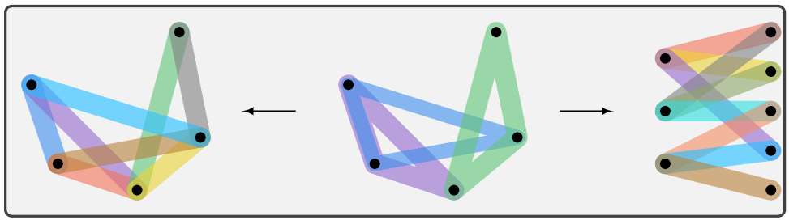

.. Hypergraph Analysis Toolbox documentation master file, created by
   sphinx-quickstart on Mon Oct  3 14:52:46 2022.
   You can adapt this file completely to your liking, but it should at least
   contain the root `toctree` directive.

Hypergraph Analysis Toolbox
===========================

Introduction
============
Hypergraph Analysis Toolbox (HAT) is a software suite for the analysis and visualization of hypergraphs and
higher order structures. Motivated to investigate Pore-C data, HAT is intended as a general prupose, versatile
software for hypergraph construction, visualization, and analysis. HAT addresses the following hypergraph
problems:

1. Construction
2. Visualization
3. Expansion and numeric representation
4. Structral Properties
5. Controllability
6. Similarity Measures

The capabilities and use cases of HAT are outlined in `this notice <https://journals.plos.org/ploscompbiol/article?id=10.1371/journal.pcbi.1011190>`_. 

Contributors
************
Joshua Pickard, Can Chen, Rahmy Salman, Cooper Stansbury, Sion Kim, Amit Surana, Anthony Bloch, and Indika Rajapakse

Bug Reporting
-------------
Please report all bugs or defects in HAT to `this page <https://github.com/Jpickard1/Hypergraph-Analysis-Toolbox/issues>`_.

.. toctree::
   :maxdepth: 2
   :caption: Contents:

   install.rst
   tutorials.rst
   HAT.rst
   ref.rst
   dev.rst

Indices and tables
==================

* :ref:`genindex`
* :ref:`modindex`
* :ref:`search`
