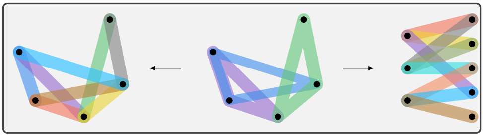

.. Hypergraph Analysis Toolbox documentation master file, created by
   sphinx-quickstart on Mon Oct  3 14:52:46 2022.
   You can adapt this file completely to your liking, but it should at least
   contain the root `toctree` directive.

Hypergraph Analysis Toolbox
===========================

Hypergraph Analysis Toolbox (HAT) is a software for the analysis and visualization of hypergraphs and
higher-order structures. HAT implements tensor-based methods for the analysis of higher-order observability/controllability,
coupling, similarity measures, and other structural properties. HAT contains methods for the following hypergraph tasks:

1. Construction
2. Visualization
3. Expansion and numeric representation
4. Structural Properties
5. Observability/Controllability
6. Similarity Measures

This software was designed to analyze higher-order biological data, such as chromatin structures observed with Pore-C. The capabilities and use cases of HAT are outlined in `this PLOS Computational Biology article <https://journals.plos.org/ploscompbiol/article?id=10.1371/journal.pcbi.1011190>`_. 

Contributors and Related Papers
*******************************
Joshua Pickard, Can Chen, Rahmy Salman, Cooper Stansbury, Sion Kim, Amit Surana, Anthony Bloch, and Indika Rajapakse

**Software Paper**

8. Joshua Pickard, Can Chen, Rahmy Salman, Cooper Stansbury, Sion Kim, Amit Surana, Anthony Bloch, and Indika Rajapakse. "HAT: Hypergraph analysis toolbox." PLOS Computational Biology 19, no. 6 (2023): e1011190.

**Methods Papers**

7. Joshua Pickard, Anthony M. Bloch, and Indika Rajapakse. "Scalable Hypergraphs Algorithms for Observability of Gene Regulation." In 2025 23rd European Control Conference (ECC) `[PDF] <https://drive.google.com/file/d/1WWkUyEWZEstOhsKrHBNEU680IBE8Kn0K/view?usp=sharing>`_

6. Joshua Pickard, Can Chen, Cooper Stansbury, Amit Surana, Anthony M. Bloch, and Indika Rajapakse. "Kronecker product of tensors and hypergraphs: structure and dynamics." SIAM Journal on Matrix Analysis and Applications 45, no. 3 (2024): 1621-1642. `[PDF] <https://drive.google.com/file/d/1Nr3o1rr1O-32e-Qsl1RRNNUcLGoRkdJ9/view>`_

5. Joshua Pickard, Cooper Stansbury, Amit Surana, Indika Rajapakse, and Anthony Bloch. "Geometric aspects of observability of hypergraphs." IFAC-PapersOnLine 58, no. 6 (2024): 321-326. `[PDF] <https://drive.google.com/file/d/1-5AL_rOvAm-aUClSfyy9MpED7h7_L76o/view>`_

4. Joshua Pickard, Amit Surana, Anthony Bloch, and Indika Rajapakse. "Observability of hypergraphs." In 2023 62nd IEEE Conference on Decision and Control (CDC), pp. 2445-2451. IEEE, 2023. `[PDF] <https://drive.google.com/file/d/1FQxRj5VdPkY-P64ek7rq4lp9jQW9MLFP/view>`_

3. Amit Surana, Can Chen, and Indika Rajapakse. "Hypergraph similarity measures." IEEE Transactions on Network Science and Engineering 10, no. 2 (2022): 658-674. `[PDF] <https://drive.google.com/file/d/1Dc4nSkkZyk4axOAshdRDXo8Gx24h4M-d/view>`_

2. Can Chen, Amit Surana, Anthony M. Bloch, and Indika Rajapakse. "Controllability of hypergraphs." IEEE Transactions on Network Science and Engineering 8, no. 2 (2021): 1646-1657. `[PDF] <https://drive.google.com/file/d/12aReE7mE4MVbycZUxUYdtICgrAYlzg8o/view>`_

1. Can Chen, and Indika Rajapakse. "Tensor entropy for uniform hypergraphs." IEEE Transactions on Network Science and Engineering 7, no. 4 (2020): 2889-2900. `[PDF] <https://drive.google.com/file/d/1-d4uR5KT3iDpOd69aCQVjNZzMyILXp5E/view>`_

Bug Reporting
-------------
Please report all bugs or defects in HAT to `this page <https://github.com/Jpickard1/Hypergraph-Analysis-Toolbox/issues>`_.

.. toctree::
   :maxdepth: 1
   :caption: Contents:

   install.rst
   tutorials.rst
   HAT.rst
   dev.rst
   ref.rst

Indices and tables
==================

* :ref:`genindex`
* :ref:`modindex`
* :ref:`search`
